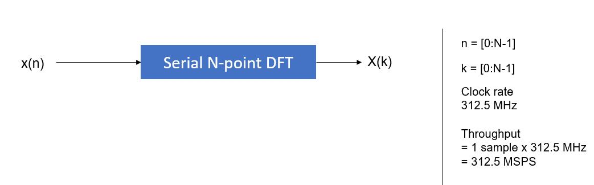
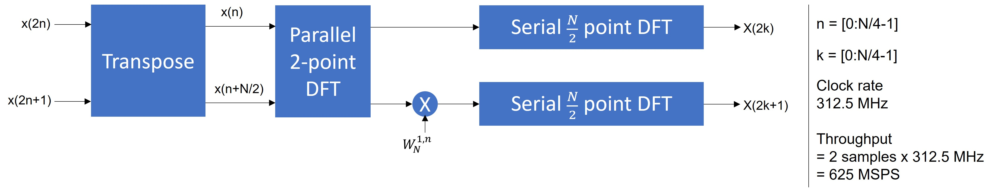
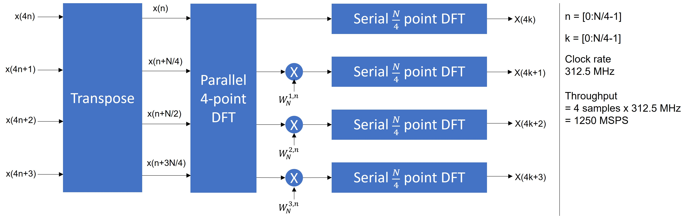

# Vitis HLS SSR FFT Generator
## Introduction
We use this code from :https://xterra2.avnet.com/xilinx/system-architecture/libraries/vitis-hls/ssr-fft 
thansk for sharing
The project is implemmented and integrate in VIVADO is: fft_4k_ssr2_i16_c16_t16  

Untitled.ipynb is the code software to control IP FFT after integrate with SOC system of kit FPGA KV260
File xfft_4k_ssr2_i16_c16_t16_top.hwh include memories map 

This project can be used to generate a Vitis HLS based FFT that processes data at 1x, 2x, or 4x the clock rate.  FFT sizes range from
- SSR 1x: 4 to 65536
- SSR 2x: 8 to 131072
- SSR 4x: 16 to 262144

The default IP interfaces are defined as M_AXI, but the generated code can be modified to support streaming interfaces if desired.

**DISCLAIMERS:**
- All possible combinations of input sample size, twiddle size, internal word size, and FFT size <ins>have not been tested</ins>.
- Simulation of large FFTs can take a long time (multiple hours)

**Requirements:**
- Vitis HLS
- Linux development host

## Usage
The ``generate_fft.sh`` script is used to generate the custom FFT configuration.  After the FFT is generated, a Vitis HLS project can then be created to run simulation, C synthesis, and export the design for use with Vivado IPI or as a Vitis kernel.

### Step 1: Command line FFT generation

```bash
bash ./generate_fft.sh [flag] [value]
   flags: -size, -ssr, -input_width, -internal_width, -twiddle_width, -help
   defaults:
     - size           = 16
     - ssr            = 1
     - input_width    = 16
     - internal_width = 16
     - twiddle_width  = 16
Examples:
  - print help               : bash ./generate_fft.sh -help
  - create 8K FFT            : bash ./generate_fft.sh -size 8192
  - create 8K FFT with SSR 4 : bash ./generate_fft.sh -size 8192 -ssr 4
  - full options             : bash ./generate_fft.sh -size 8192 -ssr 2 -input_width 14 -internal_width 16 -twiddle_width 18
```

A folder is created and corresponding FFT files are located in that folder after the ``generate_fft.sh`` script is run. The following code block shows example output from running the ``generate_fft.sh`` script.  Notice the last line output by the script specifies the output location of the generated FFT.
```bash
user@machine-linux-prompt$ bash ./generate_fft.sh

FFT CONFIGURATION:
  fft_size       = 16
  ssr            = 1
  input_width    = 16
  internal_width = 16 (rounded up to 8-bit boundary from requested 16-bits)
  twiddle_width  = 16
FFT code generated in directory fft_16_ssr1_i16_c16_t16

user@machine-linux-prompt$
```

### Step 2: Vitis HLS project creation

An ``hls_script.tcl`` file is generated when the ``generate_fft.sh`` script is executed.  This script can be used to create a Vitis HLS project, which can then be used for C-Simulation, C-Synthesis, C/RTL Co-simulation, and IP packaging for export to Vivado IPI or Vitis.  The generated code can also be modified to change the top-level interfaces if desired - for example, change the default m_axi interfaces to axis.

Exectue the following Linux commands to create the Vitis HLS project:
```bash
cd <project directory created by generate_fft.sh>
source <location of Vitis tool install>/settings64.sh
vitis_hls -f hls_script.tcl
```
The Vitis HLS project is created in the hls_project directory and can be opened using the Vitis HLS GUI using the command
- For Vitis HLS 2023.2 and older: `vitis_hls -p hls_project`
- For Vitis HLS 2024.1 and newer: `vitis_hls --classic -p hls_project`

**Note:** If you just want to package the FFT as a Vitis kernel (.xo file) then you can compile the FFT source code using the following Vitis commands (you will need to change the file & kernel names for your generated configuration):
  ```bash
  cd <project directory created by generate_fft.sh>

  v++ \
    --target hw \
    --compile fft_16_ssr1_i16_c16_t16.cpp \
    --platform <Vitis tool install directory>/base_platforms/xilinx_zcu104_base_202310_1/xilinx_zcu104_base_202310_1.xpfm \
    --kernel_frequency 300 \
    --kernel fft_16_ssr1_i16_c16_t16_top \
    --save-temps -o fft_16_ssr1_i16_c16_t16.xo
  ```
  The ``.xo`` file can then be added to the Vitis design using the Vitis Linker.

## FFT Architecture

The FFT architecture uses a divide-and-conquer (DnC) approach consisting of an SSR x FFT_Size/SSR configuration.  The first FFT stage in the DnC approach is a parallel FFT engine that processes SSR input samples per clock cycle.  The second FFT stage in the DnC approach consists of SSR serial FFT components.  For example, and 1K point FFT with SSR=4 will have a parallel 4-point FFT for the first stage, and four 256-point serial FFTs in the second stage.  For a second stage FFT size of 4 an HLS implementation is used; for second stage FFT sizes larger than 4 the FFT LogiCORE FFT IP is used from the hls_fft.h library.

The DnC FFT architectures for SSR1, SSR2, and SSR4 are shown below for N-point transforms:

---

<figure>
  <center><figcaption>Figure 1 - SSR1 FFT Architecture</figcaption></center>
  <center></center>
</figure>

---

<figure>
  <center><figcaption>Figure 2 - SSR2 FFT Architecture</figcaption></center>
  <center></center>
</figure>

---

<figure>
  <center><figcaption>Figure 3 - SSR4 FFT Architecture</figcaption></center>
  <center></center>
</figure>
